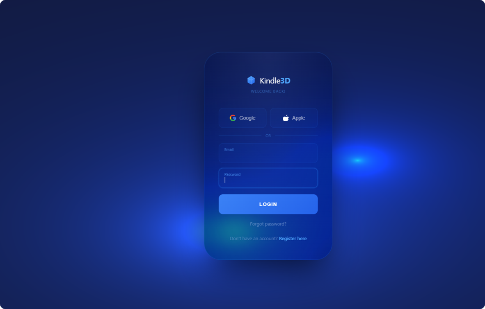

# Kindle3D 🔷

A modern login page built with React + Vite, featuring an animated WebGL background and floating label inputs.

## Demo

https://github.com/user-attachments/assets/c44847c8-df60-4ff8-8ab7-2ab713894939

## Preview

[](https://kindle3d-login-fg9s.vercel.app/)

## Tech Stack

- **React 19** — UI components
- **Vite** — build tool and dev server
- **WebGL** — animated background shader
- **CSS** — floating label inputs, glassmorphism card

## Project Structure
```
src/
├── components/
│   ├── Login.jsx        # main login component
│   └── Textbox.jsx      # reusable input with floating label
├── hooks/
│   └── useWebGLBackground.js  # WebGL animation logic
├── styles/
│   └── login.css        # all styles
├── App.jsx
└── main.jsx
```

## Features

- 🎨 Animated WebGL background
- 🪟 Glassmorphism card
- ✨ Floating label inputs
- 🔄 Loading spinner on submit
- 📱 Fully responsive

## Run Locally

```bash
# Install dependencies
npm install

# Start dev server
npm run dev
```

## Author

Yadhira Saavedra
